# Weather

Team: Matthew Lu, Kamal Kharel, Ardit Xhemajli

## App Pitch

Mobile weather dashboard that auto-detects your location, lets you track multiple cities, and shows current/hourly/daily forecasts with clear loading/error/empty states. Built for everyday use with offline-friendly persistence of your city list and settings.

## Screenshots / Demo

<p>
  <strong>Home (light)</strong><br>
  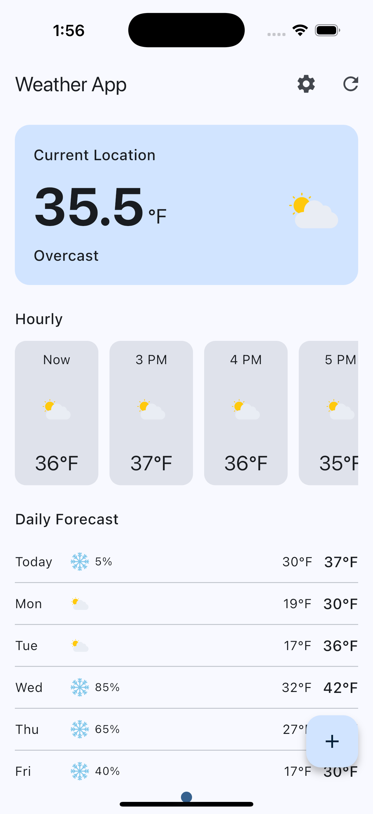
</p>
<p>
  <strong>Home (dark)</strong><br>
  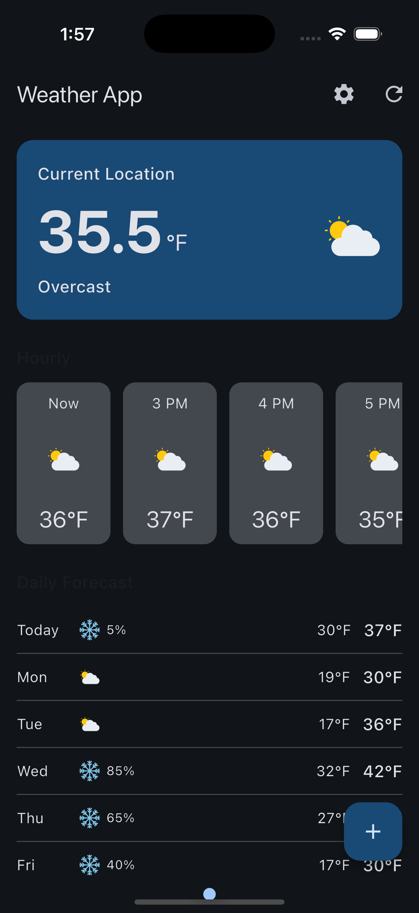
</p>
<p>
  <strong>Launch screen</strong><br>
  
</p>
<p>
  <strong>App icon</strong><br>
  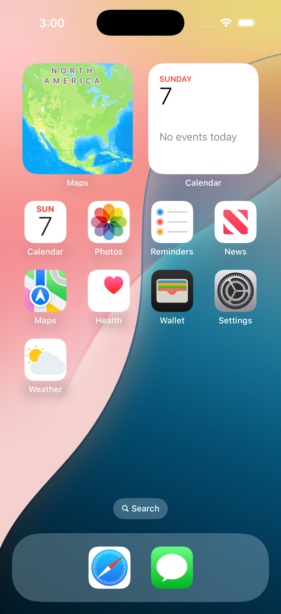
</p>
<p>
  <strong>Add / Remove City (AnimatedList)</strong><br>
  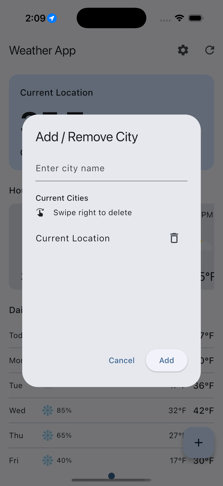
</p>
<p>
  <strong>City already added (error state)</strong><br>
  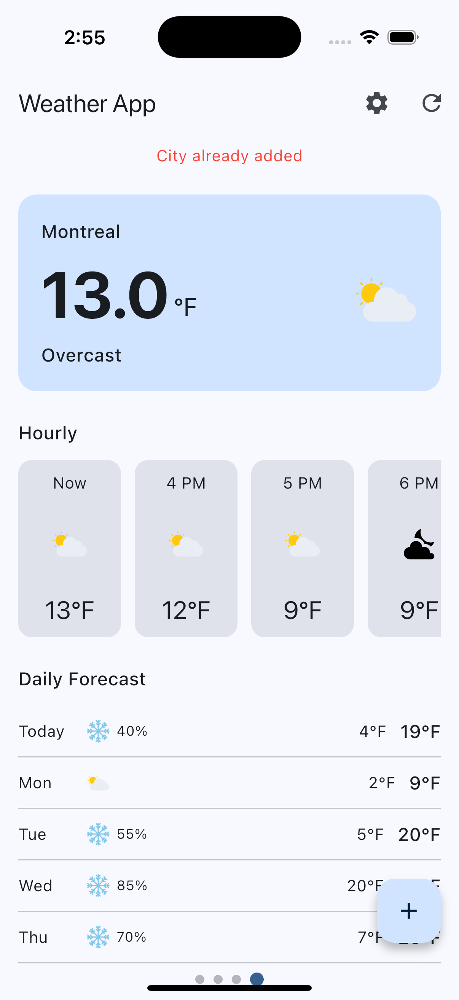
</p>
<p>
  <strong>All cities deleted (empty state)</strong><br>
  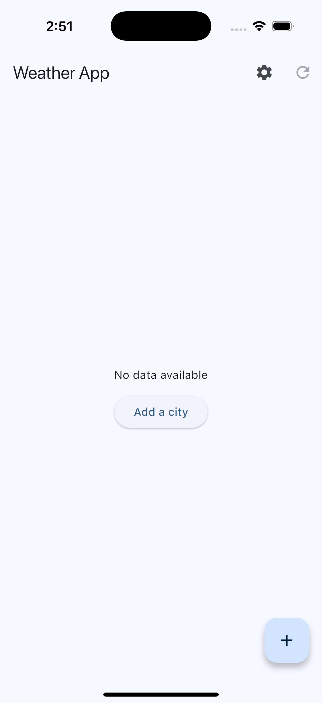
</p>
<p>
  <strong>Settings (units / dark mode)</strong><br>
  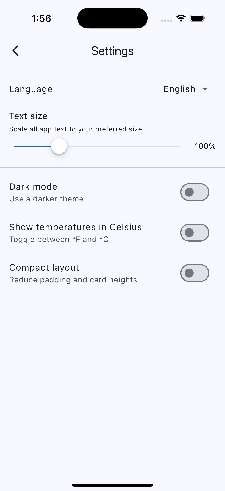
</p>
<p>
  <strong>Compact layout toggle</strong><br>
  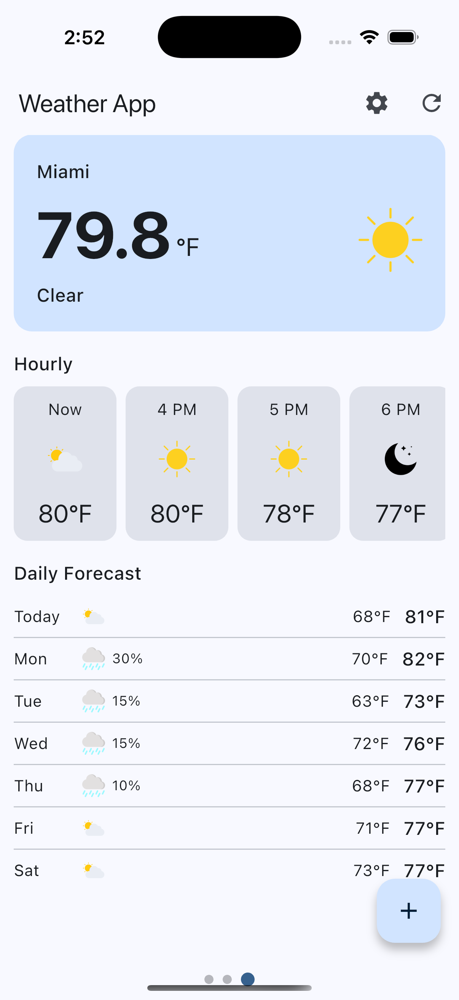
</p>
<p>
  <strong>Localization</strong><br>
  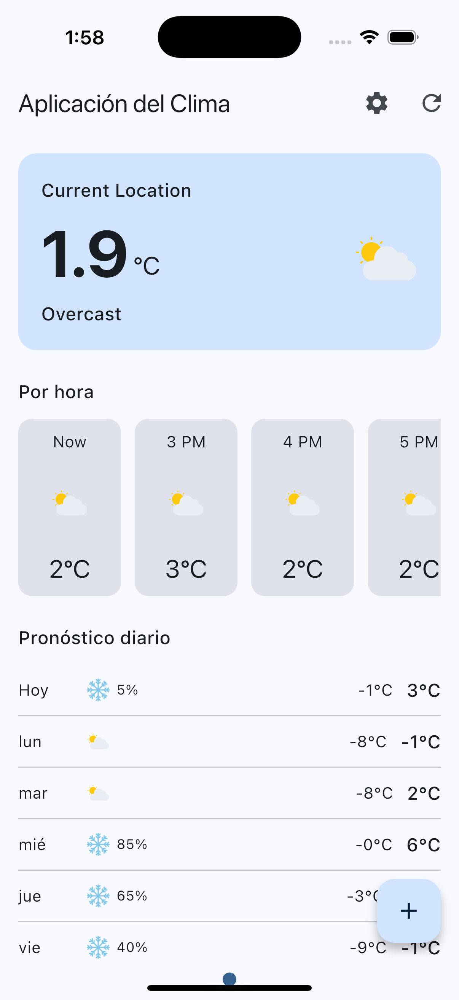
</p>
<p>
  <strong>Location request (hardware interaction)</strong><br>
  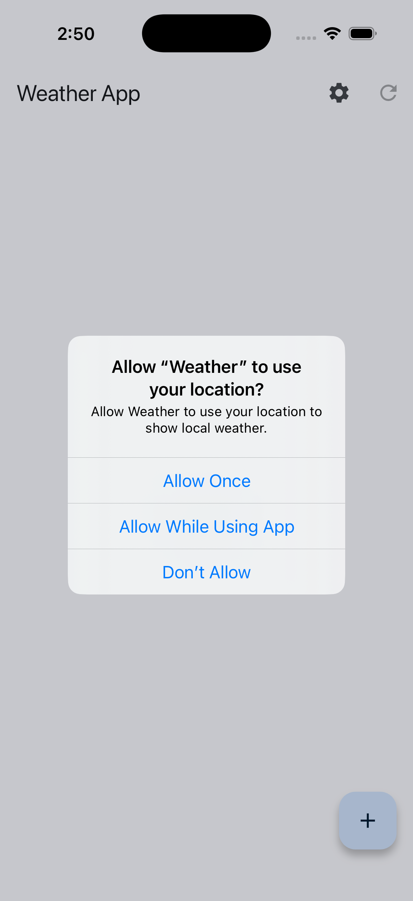
</p>
<p>
  <strong>Accessibility (text scale)</strong><br>
  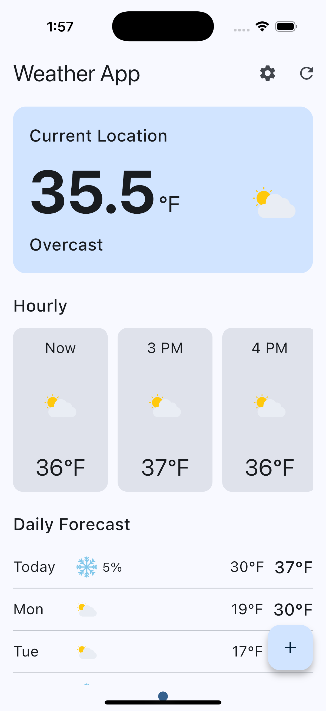
</p>

Demo video (3-5 min): 
[Link](https://drive.google.com/file/d/1E6kp6DUQv2bOoo56cWXmj5ZLz874pPL_/view?usp=sharing)

## Tech + Data

- Public REST API: Open-Meteo forecast endpoint (current, hourly, daily weather).
- State management: Provider with MVVM.
- Persistence: SharedPreferences for settings and saved cities.
- Async/isolates: `compute` used for JSON parsing (settings, weather bundle).

## Advanced Features (for team of 3)

1. Localization: English + Spanish (intl, generated localizations).
2. Gesture: Swipe-to-delete cities, horizontal paging between cities.
3. Hardware interaction: Geolocation (geolocator) for current-location weather.
4. Animations: AnimatedList add/remove (fade + size) in city management, linear progress on refresh, PageView transitions.
   Accessibility/text scaling is also supported via MediaQuery + user text scale.

## Architecture (MVVM)

```
Views: HomeScreen, SettingsScreen
    -> (Provider)
ViewModels: WeatherViewModel, SettingsViewModel
    -> Repositories: HttpWeatherRepository, SharedPrefsCityRepository, SharedPrefsSettingsRepository
    -> Services: WeatherService (Open-Meteo), GeocodingService, LocationService
    -> Models: WeatherBundle/Weather, City, Settings, HourlyModel, DailyModel
```

## Build & Run

Prereqs: Flutter 3.35.x, Xcode/Android Studio toolchains, Dart 3.9.x.

1. `flutter pub get`
2. `flutter run` (iOS requires location permission; to test your location's weather accurately, update your simulator's location.)
   Web/Desktop: supported by Flutter but untested; mobile is primary target.

## Testing

- Widget tests: `test/widgets/home_screen_test.dart`, `test/widgets/city_list_test.dart` (3+ widget scenarios total).
- ViewModel unit tests: `test/viewmodels/weather_viewmodel_test.dart`, `test/viewmodels/settings_viewmodel_test.dart`.
- Run all: `flutter test`

## Dependencies (high level)

- `provider` for state management
- `geolocator` for GPS
- `shared_preferences` for persistence
- `intl` for localization
- `http` for network calls
